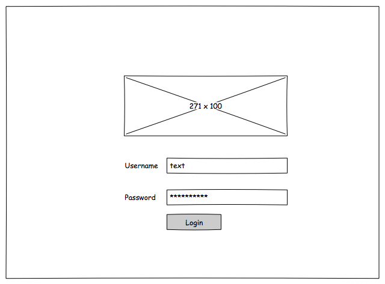
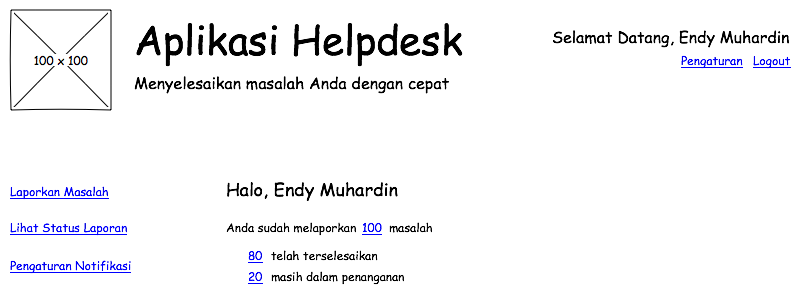
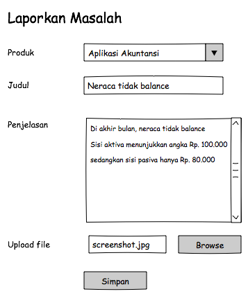
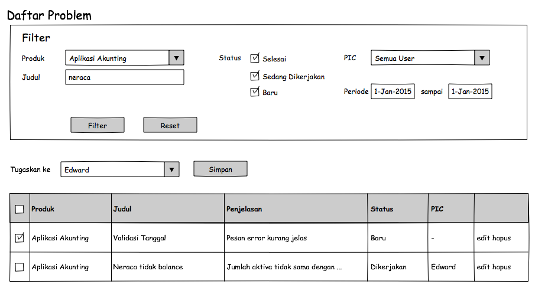
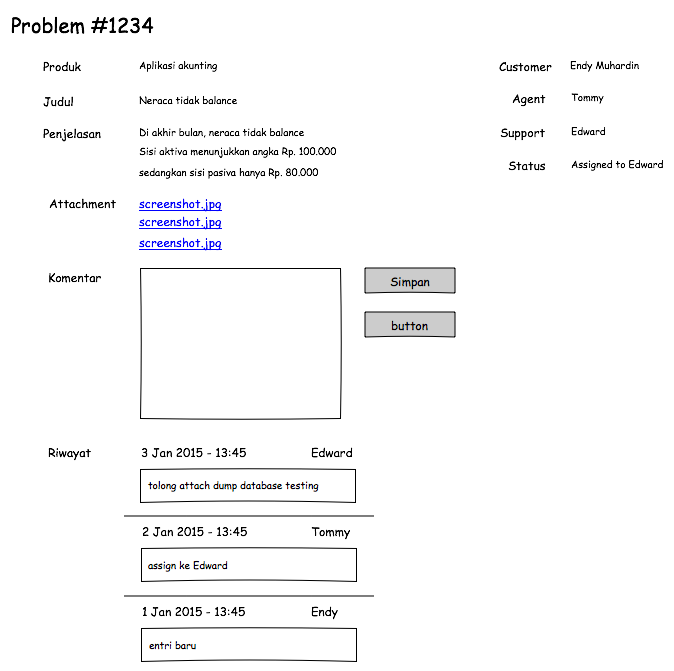

# Pendahuluan #

## Tentang isi buku ini ##

### Apa itu Ruby  ###

### Apa itu Rails  ###

### Tujuan buku ini ###

### Susunan Buku ###

## Tentang segmen pembaca ##

Pembaca diasumsikan sudah memahami:

* Dasar-dasar HTML dan CSS
* Konsep dasar pemrograman (variabel, kondisional, perulangan, function, class)
* Konsep dasar protokol HTTP (get, post, session, dsb)

## Software yang dibutuhkan ##

Untuk mengikuti pembahasan di buku ini, kita akan menggunakan:

* Sistem Operasi Ubuntu 14.04
* Database server : PostgreSQL 9
* Text Editor : apapun boleh, mau yang sederhana seperti Notepad++, Vim, Sublime Text, ataupun yang canggih seperti Eclipse, Netbeans, Webstorm

## Studi Kasus ##

Dalam buku ini, kita akan membuat aplikasi helpdesk. Aplikasi ini digunakan
untuk memasukkan pertanyaan, keluhan, atau saran terhadap penggunaan suatu
aplikasi.

Aplikasi helpdesk ini memiliki tiga jenis user:

* Customer : orang yang memasukkan pertanyaan, keluhan, atau saran (dalam
aplikasi ini disebut dengan istilah ticket)
* Agent : petugas helpdesk yang bertugas menanggapi customer. Helpdesk biasanya
tidak mengatasi sendiri masalahnya, tapi melemparkan ke personel support yang
sesuai.
* Support : petugas yang sebenarnya menangani masalah. Menerima penugasan dari
agent dan kemudian mengupdate status ticket.

### Fitur Aplikasi ###

* Umum

  * Login
  * Logout
  * Dashboard / Welcome Page
  * menerima notifikasi bila status ticket berubah

* Customer

  * input ticket dengan beberapa field : produk/aplikasi (combo), judul,
penjelasan, screenshot (bila ada)
  * melihat status ticket

* Agent

  * melihat daftar ticket yang baru masuk
  * memilih support yang akan menangani ticket
  * menentukan tingkat prioritas ticket (dengan melihat penjelasan)

* Support

  * melihat daftar ticket yang ditugaskan kepadanya
  * update status dan komentar ticket

Mockup Tampilan Aplikasi

* Login Screen

* Dashboard

* Input Tiket

* Daftar Tiket

* History Tiket

## Lisensi ##

Buku ini berlisensi Creative Commons 4.0 CC-BY-SA. Artinya, semua orang boleh menggunakan, mengubah isinya, membuat turunannya, bahkan menggunakan untuk keperluan komersial, dengan catatan:

* nama penulis asli tetap dicantumkan dalam perubahan
* lisensi pada hasil perubahan tetap sama (yaitu CC-BY-SA)

Lebih detail tentang lisensi ini bisa dibaca di websitenya https://creativecommons.org/licenses/
